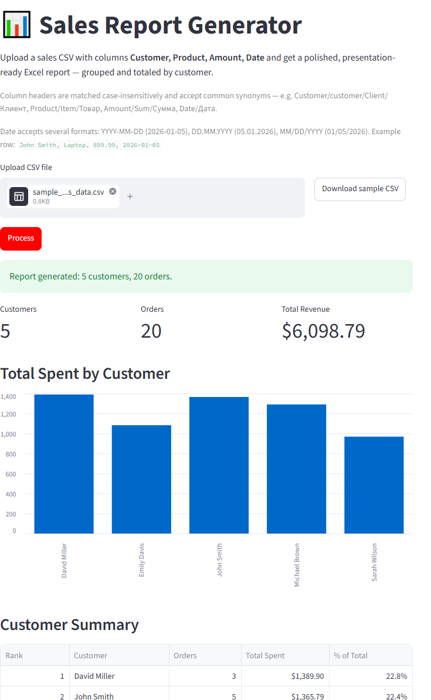

# Sales Report Generator

**[Try the live app →](https://excel-sales-report-generator-jdgssdsknrymgvy9wtd9ax.streamlit.app/)**

A Python tool that turns a raw sales CSV export into a polished, ready-to-share Excel report — automatically grouping totals by customer and formatting the workbook for presentation. Comes with both a command-line script and a Streamlit web app.



## Features

- **Flexible date parsing** — accepts `YYYY-MM-DD`, `DD.MM.YYYY`, or `MM/DD/YYYY`, including mixed formats within the same file
- **Column synonyms** — headers are matched case-insensitively and accept common synonyms (e.g. `Customer`/`Client`/`Клиент`, `Product`/`Item`/`Товар`, `Amount`/`Sum`/`Сумма`, `Date`/`Дата`)
- **Excel export** — a polished, two-sheet workbook with a branded banner, KPI summary, currency formatting, totals row, autofilter, and a bar chart — ready to share as-is
- Web UI (`app.py`) for uploading a CSV, previewing results, and downloading the report — no command line needed

## Requirements

- Python 3.9+
- `pandas`
- `openpyxl`
- `streamlit` (for the web app)

Install dependencies:

```bash
pip install -r requirements.txt
```

## Usage

### Command line

```bash
python generate_sales_report.py [input_csv] [output_xlsx]
```

Defaults to `sample_sales_data.csv` → `sales_report.xlsx` if no arguments are given.

Example:

```bash
python generate_sales_report.py sample_sales_data.csv sales_report.xlsx
```

### Web app

```bash
streamlit run app.py
```

Opens a browser UI to upload a CSV, click **Process**, preview the customer summary and raw data, and download the generated Excel report. Invalid files (missing columns, empty file, bad encoding, unparseable CSV) are caught and reported with a clear error message.

## Sample Data

`sample_sales_data.csv` contains 20 example transactions across 5 customers, useful for testing the script out of the box.

## Project Structure

```
excel-report/
├── generate_sales_report.py   # Core script + report-building functions
├── app.py                     # Streamlit web app
├── requirements.txt           # Python dependencies
├── sample_sales_data.csv      # Example input data
├── sales_report.xlsx          # Generated report (output)
├── assets/screenshot.png      # README screenshot
└── README.md
```

## Possible Extensions

- Support multiple input files / batch processing
- Add date-range filtering or monthly breakdowns
- Export a PDF summary alongside the Excel file
